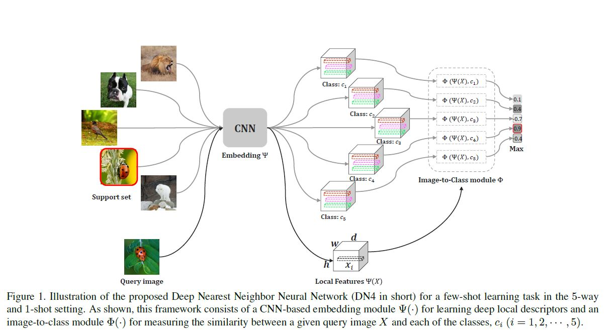

#### 미완성 포스팅으로 아직 틀린 부분이 많습니다.

#### Few-Shot Learning
Few-shot Learning은 general 모델을 학습하는 것을 주로 목표로 한다. 이 general model은 새로운 클래스를 학습할 때, 그 데이터가 1개 또는 몇 개의 sample만 있더라도 그를 이용하여 잘 학습이 되는 model이다. 
그러나, 각 클래스에 대해 극히 적은 sample이 있는 경우에는 클래스 분포를 효과적으로 표현하기가 힘들다. 

이러한 few-shot learning 문제를 해결하기 위해, 다양한 방법들이 제안되었다. 
크게 두 가지의 연구방법으로 분류되는데, Meta-learning 방법과 Metric-learning이 그것이다. Meta-Learning은 across-task meta-learner를 학습하는 방식이다. 
일반적으로 rnn이나 lstm을 이용해서 knowledge를 저장하는 memory network를 학습한다. Metric-Learning에서는 representation(knowledge)를 transfer하는 깊은 embedding space를 학습하기 위해 비교적 단순한 architecture를 사용한다. 이러한 방법에서는 metric learning이나 episodic training 메커니즘을 주로 사용하고, 두 방식 모두 few-shot learning이 발전하는데 큰 역할을 했다. 

이러한 방법들은 주로 knowledge trasfer, concept representation, relation measure를 만드는데 치중했다. 그렇기 때문에 final classification의 방법에 대해서는 별로 신경쓰지 않았다. 일반적으로, few-shot에서 일반적인 방법들이 있다. 예를 들어, image-level의 pooling feature를 사용한다던지 또는 large scale의 이미지 분류를 위해 설계된 fully connected layer를 사용한다. 

그치만, few-shot learning이라는 고유한 특성을 고려해보면 (데이터가 몇 장 없다는), 이러한 방식 (common practice)가 더이상 이전의 분류 문제처럼 잘 먹히지 않을 수 있다. 

이 논문에서는 전통방식인 Naive-Bayes Nearest-Neighbor(NBNN)이라는 방식 차용해서 few-shot learning에 활용될 수 있도록 새로운 방법을 제안한다. 

3.The Proposed Method

3.1 Problem Formulation 

$S$(support set)는 $C$개의 다른 이미지 클래스를 포함하고, 각 클래스마다 $K$개의 샘플을 포함하고 있다. query set $Q$가 주어지면, few-shot learning은 $Q$에 있는 unlabeled sample들을 $S$에 따라 분류되도록 학습한다. 이러한 방식을 
C-way K-shot classification이라 한다. 

결국 few-shot이라는건 support set $S$에 샘플 수가 적기 때문에 $Q$에 있는 sample들이 잘 분류되도록 모델을 학습하는게 어려운 일이다. 일반적으로, 다른 연구들에서는 $Q$에 대한 분류성능을 높이기 위해 auxiliary set $A$를 두고 knowledge를 transfer하는 방식을 사용한다. 
이 때, $A$에는 굉장히 많은 클래스와 label이 있는 sample들이 포함되어 있으며, support set $S$가 가진 class들은 $A$는 존재하지 않는다. 

episodic training mechanism은 $A$로부터 knowledge를 가지고 오는데 있어 효과적인 방법으로 소개된다. 즉, $A$를 이용하는데 마치 데이터가 많이 없는것과 같은 상황을 만들어 few-shot learning model을 학습하는 것이다. 

episode에는 support set $A_S$와 query set $A_Q$가 set $A$로부터 random으로 sampling 된다. $A_S$에는 $C$ 개의 class에 대해 각각 $K$개의 sample이 포함되어 있다. 

test 단계에서는 support set $S$를 이용하고, 학습이 완료된 모델은 $Q$에 있는 이미지를 분류할 수 있게 된다. 

